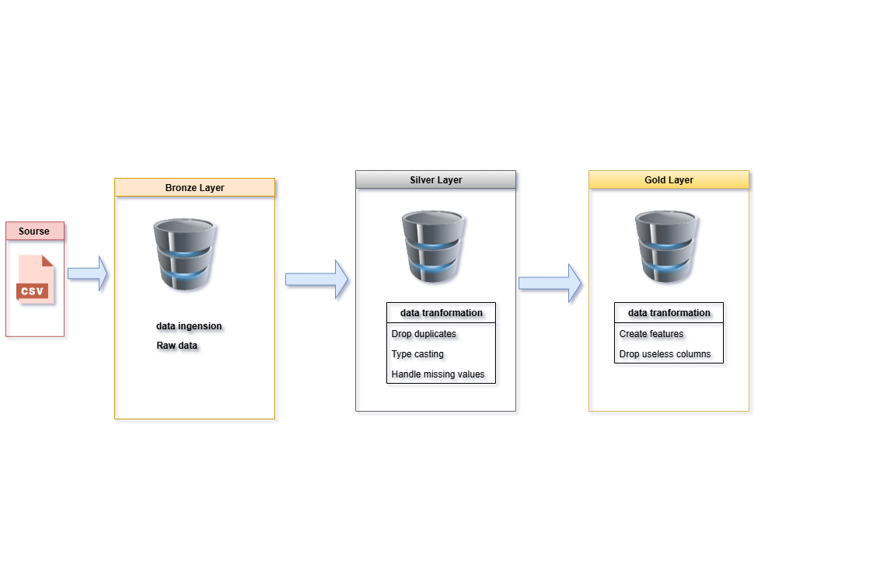

# 🛳️ Titanic Data Engineering Pipeline (Databricks + PySpark)

## 📌 Overview
This project implements a **data engineering pipeline** on the classic Titanic dataset,
using the **Medallion Architecture (Bronze, Silver, Gold)** in Databricks.

The goal is to demonstrate core **data engineering skills**:
- Data ingestion (Extract)
- Data cleaning and standardization (Transform)
- Feature engineering and curated dataset creation (Load)
- Automation via Databricks Jobs

---

## 🗂️ Project Structure
 - notebooks/ -> PySpark notebooks (Extract, Transform, Load)
 - docs/ -> Architecture diagram & job screenshots
 - data/ -> dataset (Titanic CSV)

  
---

## 🔄 Pipeline Architecture
1. **Bronze** → Raw CSV data (as-is from source)
2. **Silver** → Cleaned & standardized data (type casting, missing values, encoding)
3. **Gold** → Curated dataset with engineered features (title, family_size, age_group, has_cabin)

  

---

## ⚙️ Technologies
- Databricks (Community Edition)
- PySpark
- Delta Lake (for Bronze/Silver/Gold tables)
- Databricks Jobs (automation)

---

## 🚀 How to Run
1. Import the notebooks into Databricks.
2. Upload the Titanic CSV file to DBFS/Volumes.
3. Run the **Job** with the three tasks (Extract → Transform → Load).
4. Check the curated dataset in the Gold layer (`titanic_gold`).

---

## 📊 Example Features (Gold Layer)
- `sex` (M/F)
- `age` (integer) + `age_group` (Child/Teen/Adult/Senior)
- `fare` (double, rounded 2 decimals)
- `family_size`
- `title` (Mr, Mrs, Miss, Master, Other)
- `has_cabin` (0/1)

---

## 📷 Screenshots
- Pipeline Architecture (Bronze/Silver/Gold)
- Databricks Job (3 sequential tasks)

---

## 📝 Notes
- Dataset source: Titanic dataset from Kaggle.
- 
---

## 📄 License
MIT License
